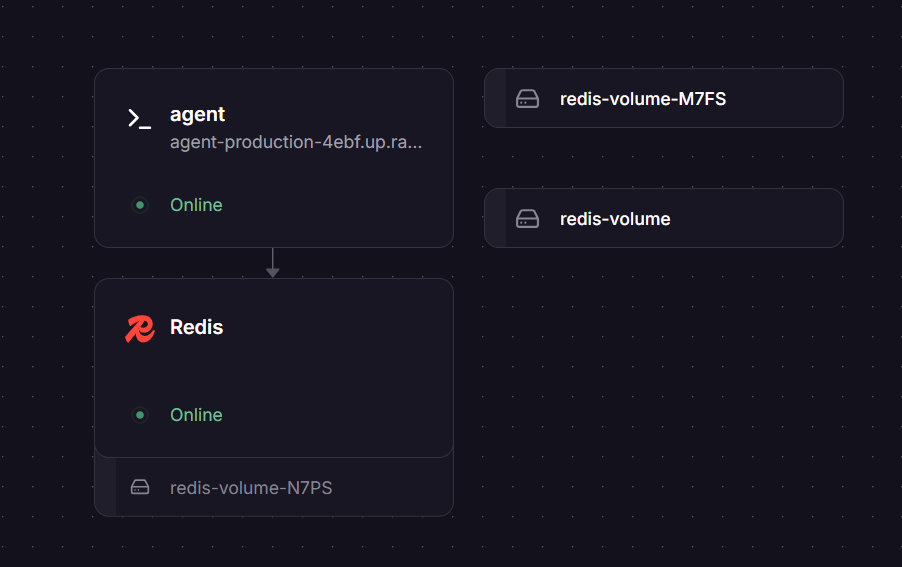
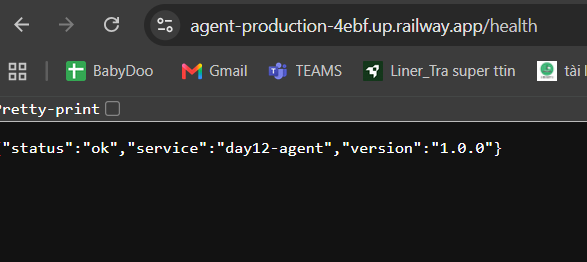

# Thông Tin Deploy — Checkpoint 5

> Điền file này sau khi deploy xong. `pytest tests/test_cp5.py` đọc file này
> để tìm địa chỉ service của bạn và gọi thử.
>
> **Chỉ ghi TÊN biến môi trường, tuyệt đối không dán giá trị API key vào đây.**
> Repo này công khai — dán khóa vào là mất khóa.

## Thông Tin Học Viên

| Mục | Nội dung |
|-----|----------|
| Họ và tên | Nguyễn Ngọc Linh |
| Mã học viên | 2A202602480 |
| Repo | https://github.com/linhmoimoi/K4-L3B-NguyenNgocLinh-2A202602480-CloudServicesAndDeployment |

## Service

| Mục | Nội dung |
|-----|----------|
| Public URL | https://agent-production-4ebf.up.railway.app |
| Platform | Railway |
| Ngày deploy | 2026-09-29 |

## Biến Môi Trường Đã Set Trên Cloud

Ghi tên biến và **nguồn giá trị**, không ghi giá trị:

| Biến | Đã set | Ghi chú |
|------|:------:|---------|
| `PORT` | ✅ | Platform tự gán |
| `AGENT_API_KEY` | ✅ | Đặt trong dashboard Variables, không nằm trong repo |
| `REDIS_URL` | ✅ | Lấy từ Redis instance (${{Redis.REDIS_URL}}) |
| `RATE_LIMIT_PER_MINUTE` | ✅ | 10 |
| `MONTHLY_BUDGET_USD` | ✅ | 10.0 |
| `LOG_LEVEL` | ✅ | INFO |

## Lệnh Kiểm Tra

Public URL đã kiểm tra: `https://agent-production-4ebf.up.railway.app`

```bash
# 1. Liveness — mong đợi 200 {"status":"ok"}
curl -i https://agent-production-4ebf.up.railway.app/health

# 2. Readiness — mong đợi 200 {"status":"ready"} (đã nối được Redis)
curl -i https://agent-production-4ebf.up.railway.app/ready

# 3. Không có API key — mong đợi 401
curl -i -X POST https://agent-production-4ebf.up.railway.app/ask \
  -H "Content-Type: application/json" \
  -d '{"question":"Hello"}'

# 4. Có API key — mong đợi 200 kèm câu trả lời
curl -i -X POST https://agent-production-4ebf.up.railway.app/ask \
  -H "Content-Type: application/json" \
  -H "X-API-Key: $AGENT_API_KEY" \
  -H "X-User-Id: sv-test" \
  -d '{"question":"Deploy là gì?"}'
```

## Kết Quả Chạy Thật

Output phản hồi thực tế từ các lệnh gọi:

```json
[GET /health]
HTTP/1.1 200 OK
{
  "status": "ok",
  "service": "day12-agent",
  "version": "1.0.0"
}

[GET /ready]
HTTP/1.1 200 OK
{
  "status": "ready",
  "redis": true
}

[POST /ask - Không key]
HTTP/1.1 401 Unauthorized
{
  "detail": "invalid or missing API key"
}

[POST /ask - Có API key]
HTTP/1.1 200 OK
{
  "answer": "Theo mình hiểu, Docker là gì liên quan tới cách hệ thống được đóng gói và vận hành...",
  "user_id": "sv01",
  "history_length": 0,
  "cost_usd": 0.00002505,
  "tokens": {
    "in": 3,
    "out": 41
  }
}
```

## Ảnh Chụp Màn Hình

Đặt ảnh trong thư mục `screenshots/`:

- `screenshots/dashboard.png` — trang quản lý service trên platform
- `screenshots/health.png` — kết quả gọi `/health` từ trình duyệt hoặc curl



